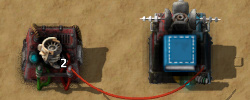
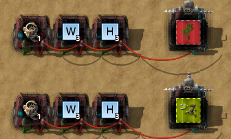
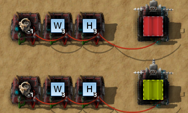
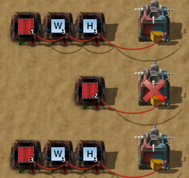
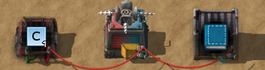
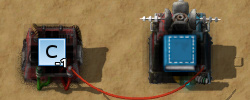
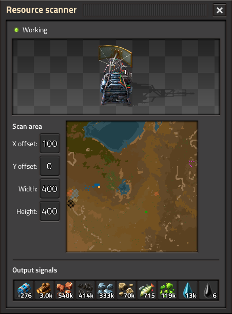

Adds a Blueprint Deployer chest which can be connected to the circuit network to build a self-expanding factory.

Example commands:

Deploy blueprint. Construction robot signal can be any value ≥ 1.

---

Deploy blueprint from book. Construction robot signal selects which blueprint to use.  If it is greater than the size of the book, the active blueprint is used instead.

---

Deconstruct or upgrade area. W = width, H = height. Supports deconstruction filters. The deployer chest will never deconstruct itself with this command.

---

Cancel deconstruction or upgrades in area.

---

Alternative deconstruction commands that do not require a deconstruction planner in the deployer chest.

-1 = Deconstruct area.

-2 = Deconstruct the deployer chest.

-3 = Cancel deconstruction in area.

---

Copy blueprint or blueprint book. The original blueprint must be in a chest (or inserter with read hand contents) on the same circuit network as the deployer chest.

---

Delete blueprint or blueprint book.

---

X and Y signals shift the position of the construction/deconstruction order.

R signal rotates the blueprint. R = 1 = 90° clockwise, R = 2 = 180°, R = 3 = 90° counterclockwise.

To change the center of the blueprint, enable grid size (1x1 is recommended), and set an absolute reference point.

Deconstruction and upgrades use X,Y as the center of the area. This can be changed to the top left corner of the area in mod settings.

---

The mod also adds a Resource Scanner that can help detect places to build.

